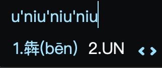

> 工欲善其事，必先利其器

我发现现在的同学们电脑用得少了，手机用得多，甚至很多同学都是习惯语音转文字，但是毕竟编程还是需要用到电脑，怎样快速准确地输入代码成了同学们学习编程的第一道难关。

## 怎样做到「快、准、稳」？

### 选择一款合适的输入法

可能学校机房的输入法已经给大家安装好了，都是「QQ 拼音输入法」，市面上类似的还有「搜狗输入法」、「百度输入法」等，这些输入法大同小异，都是具有一定记忆能力的「智能」输入法，它们会记录你经常输入的文字以及网上的一些热词，方便你快速输入单词，还有一定的纠错和联想能力，这样你在输入的过程，不需要每个拼音都正确，这些输入法也会帮你去纠正。

当然有同学新买的电脑会自带一个微软输入法，这个输入法也很好用，不喜欢第三方的软件的同学，完全可以使用「微软输入法」。

> 当然老版本自带的「智能 ABC 输入法」 就不推荐使用了

### 拼音

拼音输入法要求同学们熟练掌握拼音，但是，小学语文基础薄弱的同学也不用怕，拼音其实很简单，毕竟都是中国人，拼音有什么难的。

### 指法

这里的「指法」其实是手指放在键盘上的什么位置，以及在打字的时候，不同手指负责的键盘上的不同位置。好的指法会让我们打字效率事半功倍。

### 盲打

> 「什么？盲打？？我连键位都不熟悉，还要我盲打？？？」

一般不会盲打的同学是很害怕盲打的，但是你想想，你用手机飞速打字的时候，真的一直盯着键盘看吗？所以键盘盲打不要怕它，当你熟练之后，自然而然的都会盲打了，但是关键的是，你要刻意地训练盲打，一开始会慢些，但是练习的时间久了，速度就快上去了。

### 多练习

说了这么多，练习才是王道，下面是几个我用过的网站，大家平时有空的时候可以练练：

- 基础练习 👉 [在线打字练习网站](https://dazidazi.com)

- ❤ 练打字的时候，顺便背背英文单词和编程词汇 👉 [Qwerty Learner](https://kaiyiwing.gitee.io/qwerty-learner/)

当然在学校机房也可以练习打字，那就使用「金山打字通」软件，机房电脑都安装了。

## 灵活的中英文切换

打代码的时候经常需要中英文切换，在使用中文输入法的时候，按下 **「Shift」键** 就可以切换中英文，不需要用鼠标去点击右下角的「中/英」按钮，这样太慢了。

另外输入英文大写是 **按住「Shift」键的同时输入英文字母，然后回车**，我不推荐按 Shift 上面的「CapsLock」键的，因为这样再切回来就需要再按一下 CapsLock，这样也慢了。

## 半角和全角？傻傻分不清

中文输入会有全角和半角之分，**在编程中，只能使用半角。**

> 这里有更详尽的内容 https://zhuanlan.zhihu.com/p/351829045

## 中文输入小技巧

### 「U 模式」

当你遇到不会读的字的时候，比如：犇骉羴垚淼焱燚，你可以使用 U 模式

先输入一个 u，然后按照偏旁部首或间架结构来拆分这个陌生字。

比如「犇」这个字，可以看做三个**牛(niu)**合在一起，所以你可以打 `uniuniuniu`，这样就会出来

同理，你就可以打出 骉羴垚淼焱燚 这几个字了。

还有一种情况是这样，比如你想输入「休」字，你也可以使用 U 模式输入，休字由单人旁和木组成，那就先输入 u，在输入 ren 和 mu

`urenmu`

