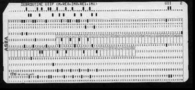

:::success

编程是人类和计算机之间的协作

:::

## 编程无处不在

编程就在我们身边，从我们用手机叫外卖到用电脑处理文字，这一切都是编程让我们生活中的日常行为成为可能，可以说编程无处不在，而且正在改变着我们的生活。

:::note

看看我们的身边，比如教室、学校、路上、家里，哪些日常生活中的东西用到了编程技术？

:::

## 编程适合所有人

不管你喜欢文科还是喜欢理科，编程都是适合所有人，每年有 2620 万专业软件开发人员，这个数字还在不断增加，当然还不考虑与编程有相关的其他职业。

在编程基础课程中，我们可以学习不同的编程语言，运用编程思维来解决问题，用技术和知识来解决学习中的难题。

因此，让我们深入了解一下什么是编程？

## 什么是编程？

:::success

简单的理解：编程就是向计算机发出一组指令来执行各种任务。

:::

这里的指令可以是各种类型的。例如：

- 两个数字相加
- 找出一组数字中的最大值

你可以把自己想象成正在打游戏，你在手机上做出的指令，经过手机的处理，最后游戏中的角色按照你的指令做出相应的行为。当然指令越复杂，结果就越复杂。

当然执行的任务可以是像上面的简单的任务，也可以是涉及多条指令的复杂任务。例如：

- 计算利率
- 设计游戏角色 AI 判定

上面这两个任务就需要多条指令。因此，总而言之，编程是一种告诉计算机完成特定任务的方法。

## 编程 VS 编码（写代码）

有人说编程就是写代码，编程和编码有什么区别吗，我们在这里学习如何写代码吗？

编程和编码实际上有不同的定义

- 编程是一种思考过程，把指令提供给计算机的一个心理过程
- 而编码（写代码）是将这些思考转化成计算机可以理解的语言的过程

过去一个世纪里，人们一直试图弄清楚如何通过不同的编程语言才能更好地与计算机进行通信，编程已经从机器读取打孔纸带发展成鼠标拖拽积木的方式，当然大部分的编程都需要写代码。

直到今天，人们还在开发新的编程语言，试图提高我们的编程效率，也许未来，我们可以通过脑机接口进行意念编程。

## 编程是人类与计算机的交际舞

当我们通过代码向计算机发出指令时，我们以自己的方式与计算机进行通信。但是，由于计算机的构造与我们不同，因此我们必须以计算机可以理解的方式翻译我们的指令。

计算机一方面很强大：拥有极快的预算速度、无限的存储容量、几乎完美的计算能力、全天候工作不需要休息等等，但是另一方面却又很“弱智”：没有能力跟人类直接交流、不给指令做不了任何事、非常字面的解释指令（以后会知道，少一个分号就报错）、不能理解抽象事物（比如你问计算机是否开心）等等。
这就意味着，我们需要和一方面很强大，另一方面很弱小的计算机跳一支动人的交际舞，可不要觉得计算机有缺点而人类没有，计算机擅长的事情正好是人类的缺点（比如：人类需要休息，容易忘事），而这支交际舞就是编程，你的编程能力高，那跳的舞就很和谐，如果编程能力差，那就很糟糕。

## 结论

随着编程成为我们生活中更重要的一部分，每个人都要了解编程是什么以及如何使用它，这一点至关重要，编程对我们的职业生涯很重要。

学习编程是一段激动人心的旅程。无论你想做一个手机 APP，或者是写一个搜索资料的程序，还是开发机器人，编程都是一项将带你走向更好生活的技能。请记住，计算机是工具。虽然学习编程最初可能令人沮丧，但如果你选择坚持下去，你将能够做出一些精彩的事情。

## 接下来做什么？

当我们知道我们要和计算机沟通，就必须学会编程语言，那什么是编程语言呢？接着学咯。