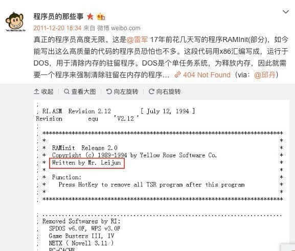

当我们需要告诉计算机怎么一步一步地做事情的时候，我们需要用到编程语言，我把编程语言亲切的比作「你在教我做事啊」


当然现在计算机还不能像人类一样「智能」，比如我要你一键三连，你就会知道长按点赞按钮，会自动一键三连。但是计算机不知道，你需要先告诉他：

- 鼠标移动到点赞按钮上
- 长按鼠标左键
- 如果在三连动画没有完成前松开鼠标，系统不会记录你的三连，三连失败
- 当三连动画结束后，系统会记录你的一键三连，成功一键三连

计算机需要这样详细的步骤，才能真正完成一键三连。


你可能觉得这没区别啊，那我再换个例子：喝水：

你在饭店，你渴了要喝水，你会叫服务员帮你倒一杯水，服务员自己知道怎么倒水，然后水送到你的桌子上，你喝掉。

但是你要让计算机来帮你倒水，那这个步骤可需要一步一步来了：

- 转身走到厨房
- 找到一个杯子
- 找到一个水壶
- 在杯子里倒入一些水
- 那着杯子走回来


计算机不会走错一步也不会跳过步骤，但是如果你的步骤写错了，计算机也会跟着错。

:::success

所以编程语言不是用来与计算机交流，而是描述做事情的过程和方法

:::

如何描述做事情的过程和方法去让计算机去执行呢？这就需要使用到计算机的语言了。

## 计算机的语言：机器语言

机器语言是计算机能直接明白的语言，由于计算机只能读懂二进制，所以机器语言是用二进制表示的。不同类型的计算机，它的机器语言是不一样的，所以需要不同的硬件平台使用不同的机器语言。

> 要用机器语言编写程序，编程人员需首先熟记所用计算机的全部指令代码和代码的涵义。手编程序时，程序员要自己处理每条指令和每一数据的存储分配和输入输出，还需记住编程过程中每步所使用的工作单元处在何种状态。这是一件十分繁琐的工作，编写程序花费的时间往往是实际运行时间的几十倍或几百倍。而且，这样编写出的程序完全是 0 与 1 的指令代码，可读性差且容易出错。在现今，除了计算机生产厂家的专业人员外，绝大多数程序员已经不再学习机器语言。

以下是一些示例：

指令部分：

- 0000 代表 加载（LOAD）
- 0001 代表 存储（STORE）
- ...

寄存器部分：

- 0000 代表寄存器 A
- 0001 代表寄存器 B
- ...

存储器部分：

- 000000000000 代表地址为 0 的存储器
- 000000000001 代表地址为 1 的存储器
- 000000010000 代表地址为 16 的存储器
- 100000000000 代表地址为 2^11 的存储器

合起来：

- 00000000000000010000 代表 LOAD A, 16
- 00000001000000000001 代表 LOAD B, 1
- 00010001000000010000 代表 STORE B, 16
- 00010001000000000001 代表 STORE B, 1

## 底层语言：汇编语言

由于机器语言使用 0 和 1 来表示，非常不方便人类去阅读，所以编程语言进化到了汇编语言：使用**符号**和**标签**来表示特定的机器语言的操作。

举个例子，告诉 CPU 把一个 8 位二进制数（比如 01100001）移动到寄存器（寄存器是 CPU 中存放二进制数据的地方），用机器语言是这样表示的：移动的指令是 10110，后面要跟着寄存器的三位标识符 000，所以把 01100001 加载到寄存器的机器语言是：

```
10110000 01100001
```

二进制看起来太乱了，所以很多时候，我们使用十六进制来表示，更加具有可读性，所以 10110000 01100001 用十六进制表示为：

```
B0 61
```

用汇编语言表示将会更加让人类明白点，同样是「把一个八位二进制数 01100001 移动到寄存器」，汇编是这样表示的：

```plaintext showLineNumbers {4}
; 加载9
; h表示十六进制hex，61h 转成十进制是 97
; 数据移动到寄存器其实就是加载数据的意思
MOV AL, 61h
```

解释：

- 分号 ; 后面跟着的是注释，计算机不执行，只是给我们看的，方便阅读和记忆，真正执行的代码是第 4 行
- MOV 表示**移动**（move 的缩写）
- AL 表示寄存器（具体来说 AL 是**低八位寄存器**，AH 是高八位寄存器）

这样来看，当 `10110000 01100001` 进化成 `MOV AL, 61h` 之后，汇编语言相比较机器语言，更加适合我们人类。

所以汇编语言写起来就像这样：

```
push ds
push ax
xor ax, ax
mov ds, ax
mov ax, ds:[94]
cmp ax, offset NewInt9
pop ax
pop ds
jnz GoINT1C
mov cs:StopFlag, 0
```

> push、pop、mov、xor、cmp 等指令不区分大小写。英语好的同学会知道 push 是推进，mov 是移动，pop 推出。这些指令至少比满屏幕的 0 和 1 更让人能看懂

> 感兴趣的同学可以搜索下：队列，栈，出栈和入栈

:::note

大家可以了解下小米雷总在 1994 年写的汇编代码，功能是清理内存数据，能写出质量如此之高的人也不多了，雷总还出版过一本《深入 DOS 编程》的大学教科书，真的是天才啊！



:::

<BVideo src="BV1es411D7sW" />


<BVideo src="BV1R5411V7yA" />


:::note

汇编语言是一种低级语言，在不同的系统中，汇编语言对应着不同的机器语言，也就是说一种汇编语言专门用于某种特定的计算机系统，不能做到通吃。

而且汇编语言过于的底层，比如寄存器移位这种操作，往往不能做到足够的方便，现如今就算是计算机操作系统这种与硬件直接交互的代码也只有极少部分的汇编代码，比如 Linux 内核源码中只有 2% 的汇编，而剩下的 98% 则用 C 语言写的，而 C 语言正是一种**高级编程语言**。

:::

## 面向人类的编程语言：高级编程语言

:::note

编程语言发展历史 知乎
https://zhuanlan.zhihu.com/p/397606172

:::
