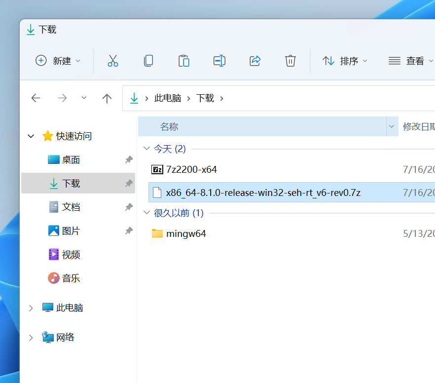

## 在线

### 本网站

本站可提供交互式编程学习，可以进行简单的代码编写、运行。

### 我做的自测猫网站

平时我的课程中，大家可以使用 [自测猫](https://code.hyyz.izhai.net)，选择 C 语言进行在线编写，测试自己的代码。

## 本地

在没有网的情况下，你想写 C 语言代码，需要先安装**编译器**，然后再安装**代码编辑器**。

### C 语言编译器

C 语言需要 [编译器](https://baike.baidu.com/item/%E7%BC%96%E8%AF%91%E5%99%A8) 来编译代码，你可以认为你的 C 语言代码需要一个软件来支持它执行，你可以使用 [MinGW-w64](https://www.mingw-w64.org/) 这个软件来编译你的 C 语言文件。

[MinGW-w64 下载地址](https://sourceforge.net/projects/mingw-w64/files/mingw-w64/mingw-w64-release/)

页面往下拉，找到 GCC 最新版下面的 **x86_64-win32-seh** 链接（下图红框部分），下载软件包

下载好了之后是一个 7z 的压缩包

解压后得到一个叫 mingw64 的文件夹

### Visual Studio Code

#### VSCode 安装

微软的 [VSCode 代码编辑器](https://code.visualstudio.com) 是不错的选择

<BVideo src="BV1Cu411y7vT" />

#### VSCode 的 C 语言插件
