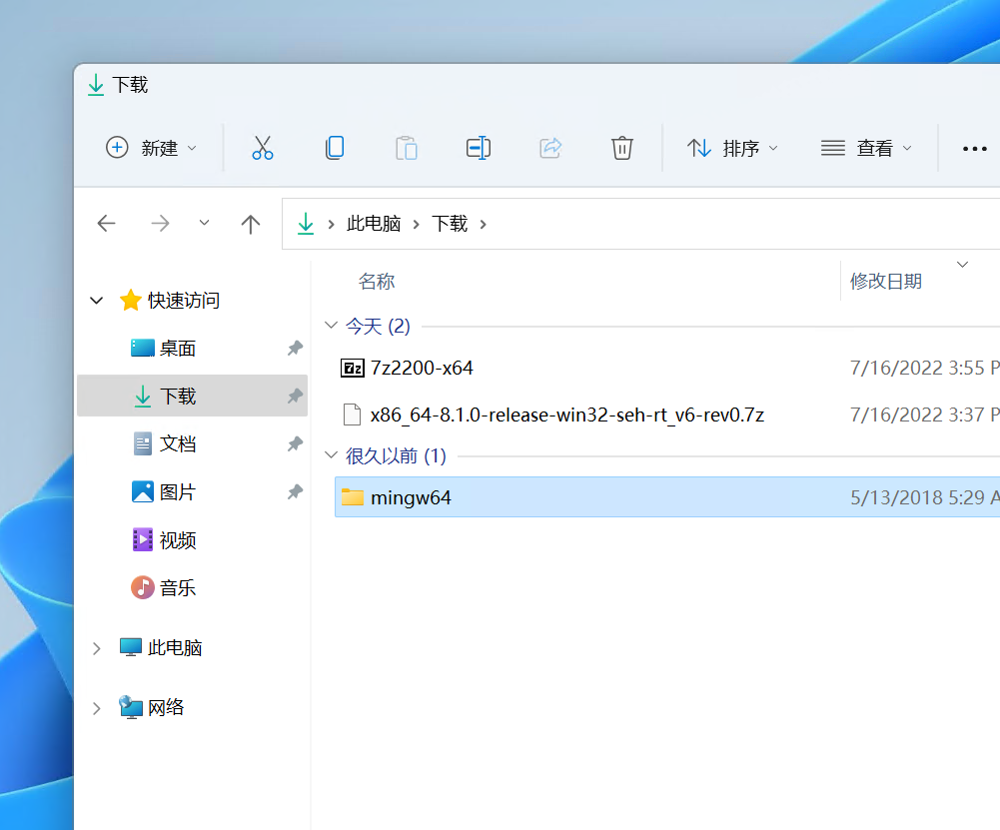

## 在线

### 本网站

本站可提供交互式编程学习，可以进行简单的代码编写、运行。

### 我做的自测猫网站

平时我的课程中，大家可以使用 [自测猫](https://code.hyyz.izhai.net)，选择 C 语言进行在线编写，测试自己的代码。

点击最右边的 **运行** 按钮，看看输出的结果

<BVideo src="BV1bd4y1Q7LU" />

## 本地

在没有网的情况下，你想写 C 语言代码，需要先安装 **编译器**，然后再安装 **代码编辑器**。

### MinGW-w64

C 语言需要 [编译器](https://baike.baidu.com/item/%E7%BC%96%E8%AF%91%E5%99%A8) 来编译代码，你可以认为你的 C 语言代码需要一个软件来支持它执行，你可以使用 [MinGW-w64](https://www.mingw-w64.org/) 这个软件来编译你的 C 语言文件。

<BVideo src="BV1Ft4y1t7jh" />

#### 1. 下载 MinGW-w64

[MinGW-w64 下载地址](https://sourceforge.net/projects/mingw-w64/files/mingw-w64/mingw-w64-release/)

页面往下拉，找到 GCC 最新版下面的 **x86_64-win32-seh** 链接（下图红框部分），下载软件包

下载好了之后是一个后缀名为 7z 的压缩包

> 如果解压不了，可以安装 [7-Zip](https://www.7-zip.org/)

解压后得到一个叫 mingw64 的文件夹

把 **mingw64** 文件夹放到 C 盘的 Program Files 文件夹里面去

#### 2. 设置系统环境变量

mingw64 文件夹内有编译 C 文件的命令，但是我们想在任意地方都可以调用这些命令，就需要设置系统环境变量。

1. 找到系统环境变量

打开系统设置，搜索 “编辑系统环境变量”

在弹出框中点击“环境变量”

在弹出框中的**系统**环境变量中，双击打开 Path 这一行

2. 新建系统环境变量

复制路径 mingw64 文件夹下的  bin 文件夹路径

新建一条系统环境变量，粘贴路径（记住是 bin 文件夹）

3. 重启计算机

#### 3. 测试

设置好系统环境变量并重启后，打开 命令提示符 CMD，输入 `gcc --version` 命令，正常显示就算可以了。

### Visual Studio Code

我们用于写代码的软件，微软的 [VSCode 代码编辑器](https://code.visualstudio.com) 是不错的选择

<BVideo src="BV19Y4y177Ho" />

#### 1. 安装和汉化

#### 2. 安装 C/C++ 语言插件

#### 3. 安装 Code Runner 插件

这个插件是用来方便运行代码文件或者片段的，非常好用。但是会遇到一些问题，解决方法如下：

<BVideo src="BV1ga411D7Dn"/>

## 接下来做什么？

