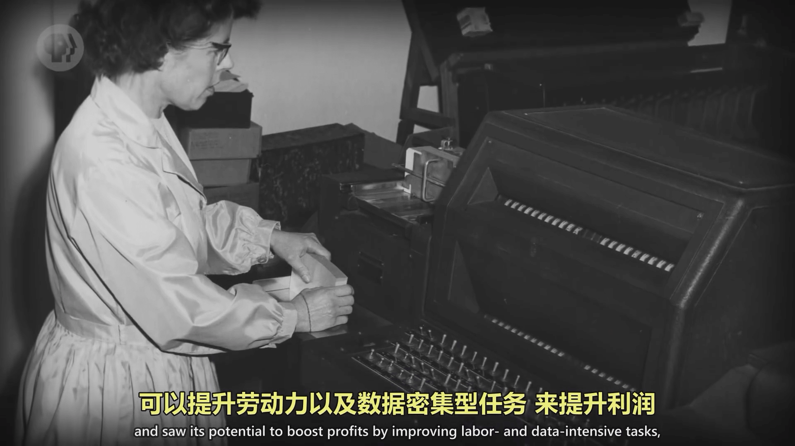
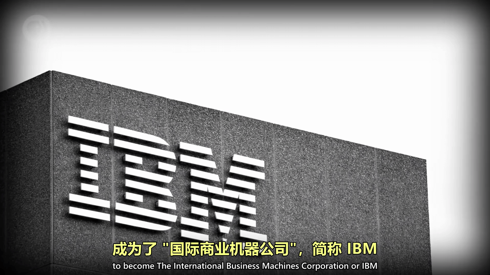

<BVideo src="BV1EW411u7th" p="1" />

## 1、计算机对世界的影响

计算机改变了我们生活几乎所有方面，计算机对我们社会的重要性不言而喻。

类比与“工业革命”使人民的生产水平大大提高，计算机的出现与发展通过使世界进步飞速，也许未来人民会将计算机的出现与发展，称作“信息革命”。

## 2、计算机的实质

**通过一层层的抽象，来做出复杂操作**，本课程会从最底层的0和1，到逻辑门，CPU，操作系统，整个互联网等一层层讲解。

## 3、计算机的起源

### 算盘

最早的计算设备是算盘，它是手动计算器，用来帮助加减数字，集存储和计算为一体，它的出现是因为社会的的规模已经超出个人心算的能力（视频中举例的最基本的一种算盘，和我们日常中见到的不一样，和小学的教具类似）

:::note 

在演示算盘的用法的时候，很像是之后的进制计算

:::

人类发明的各种巧妙的计算设备：
- 星盘：让船只可以在海上计算纬度
- 计算尺：帮助计算乘法和除法
- 上百种的时钟：计算日出、潮汐、天体位置、或者纯粹计时

这些设备让原先费力的计算变得更快、更简单、更精确。**降低门槛，加强我们的能力。**

### 步进计算器

在以前 Computer 并不是指计算机，而是指负责计算的人，这个职业在 1600 年至 1800 年存在。

后面，计算机才逐渐指机器，其中以**步进计算器**最为有名。

步进计算器是第一台能自动进行加减乘除四则运算的机器，它逢十自动进一，主要利用齿轮间的转到进行进位，乘法和除法实际上是多个加法和减法。

但即使有机械计算器，算一个结果可能要几小时甚至几天，而且机器昂贵，所以出现了预先算好的“计算表”，需要结果只要查表就可以了。

> 二战的射程表，用于计算炮弹飞行轨迹和落点

### 差分机、分析机

后来，由于生活和战争的需要，开发一个先进的计算机器越来越重要。这时，一个很跨时代的概念出现了 —— 分析机，这个分析机不仅能完成加减乘除运算，还能对数据和事件进行一系列操作，不过由于观念太超前，当时无法做出来。但是，这种通用的自动的计算机器的概念，给时代带来了新的思想。

> 英国数学家 [Ada Lovelace（阿达·洛芙莱斯）](https://baike.baidu.com/item/%E9%98%BF%E8%BE%BE%C2%B7%E6%B4%9B%E8%8A%99%E8%8E%B1%E6%96%AF) 给分析机写了假象的程序，她说：“未来会诞生一门全新的、强大的、专为分析所用的语言”，因此 Ada 被认为是世界上第一位程序员。

### 打孔卡片制表机

1890 年的美国人口普查，如果要用人力来算，预计要 13 年才能完成，但是人口普查是 10 年一次，所以美国政府找来了 Herman Hollerith（赫尔曼·何乐礼），他为政府开发了一个**机器打孔制表机**，通过打孔来记录数据，能够更快地记录人口情况。这一发明大大提升了人口普查的效率。

> 机器打孔机是手动的 10 倍左右，使得人口普查两年半就完成，节省上百万美元。

后来，由于社会发展，利用机器来代替人类手工来提升效率的需求增加，Herman Hollerith 成立了制表机器公司。这家公司后来与其他机械公司合并，成为了 **International Business Machines Corporation 国际商业机器公司**，简称 [IBM](https://baike.baidu.com/item/ibm)。

## 接下来

这些电子机械的“商业机器”取得巨大成功，改变了商业和政府。随着人口爆炸和经济贸易的兴起，要求更快更灵活的工具来处理数据，这就来到了电子计算机时代。