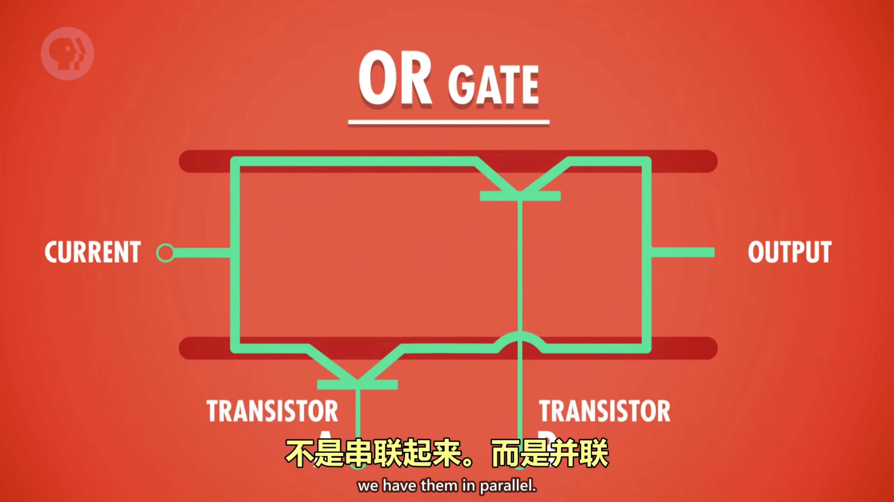

<BVideo src="BV1EW411u7th" p="3" />

## 二进制

### 什么是二进制

电路闭合，电流流过，代表 **真** ，电路断开，无电流流过，代表 **假** 。

二进制也可以写成 **0** 和 **1** 而不是 **True** 和 **False** ，只是不同的表达方式罢了

### 为什么用二进制

晶体管可以不是单纯的 **开和关** ，还可以让不同大小的电流通过。

**第一个原因** ：一些早期的计算机是三进制的，有三种状态，甚至五进制，有五种状态。状态越多，越难以区分信号。所以把两种信号尽可能分开，只用 **开和关** ，可以尽可能的减少这类问题。

> 例如手机快没电了，或者附近有电噪音，信号可能会混在一块，而每次百万次变化的晶体管会让这个问题变得更糟
>
> 

​**第二个原因** ：有整一个数学分支存在，专门处理「真」和「假」，它已经解决了所有法则和运算，叫 **布尔代数** 。**乔治·布尔（George Boole）** 是布尔二字的由来。

### 布尔逻辑

在常规代数中，变量的值是数字，可以进行加法或乘法之类的操作。但在布尔代数中，变量的值是 **True** 和 **False** 能进行逻辑操作。

## NOT、AND、OR

### NOT GATES（非门）

NOT 操作把布尔值反转，把 True 进行 NOT 后就会变成 False，反之亦然。

| INPUT（输入） | OUTPUT （输出） |
| :-----------: | :-------------: |
|     TRUE      |      FALSE      |
|     FALSE     |      TRUE       |

> 用晶体管可以轻松实现这个逻辑。晶体管只是电控制的开关，有三根线：两根电极和一根控制线，控制线通电时，电流就可以从一个电极流到另一个电极。

### AND GATES（与门）

AND 操作有两个输入和一个输出。如果两个输入都是 True，输出才是 True；两个输入有一个为 True，输出为 False；两个输入都是 False，输出还是 False。

| INPUT A（输入 A） | INPUT B（输入 B） | OUTPUT（输出） |
| :---------------: | :---------------: | :------------: |
|       TRUE        |       TRUE        |      TRUE      |
|       FALSE       |       TRUE        |     FALSE      |
|       TRUE        |       FALSE       |     FALSE      |
|       FALSE       |       FALSE       |     FALSE      |

> 要实现 AND 操作，需要两个晶体管连在一起，得到两个输入一个输出。只有当两个开关都是开时，电流才会通；其中任何一个没有通，电流则不通。

### OR GATES（或门）

OR 操作也有两个输入和一个输出。但是它只需要满足一方为 True，结果就为 True；只有双方都为 False 时，结果才是 False。

| INPUT A（输入 A） | INPUT B（输入 B） | OUTPUT（输出） |
| ----------------- | ----------------- | -------------- |
| TRUE              | TRUE              | TRUE           |
| FALSE             | TRUE              | TRUE           |
| TRUE              | FALSE             | TRUE           |
| FALSE             | FALSE             | FALSE          |

> 要实现 OR 操作，需要两个晶体管并联起来。任意一处的开关为开时，电流都能通过。
> 

### NOT、AND、OR 的电路符号

## XOR 异或

除了与或非三门之外，还有一个布尔操作叫做 **异或（XOR）**。XOR 就像普通 OR，但有个区别：如果两个输入都为 True，但结果为 False。想要输出 True，其中一个输入必须是 True，另一个输入为 False，这样结果才会是 True；俩输入均为 False 时，结果与 OR 一样。

| INPUT A（输入 A） | INPUT B（输入 B） | OUTPUT（输出） |
| :---------------: | :---------------: | :------------: |
|       TRUE        |       TRUE        |     FALSE      |
|       FALSE       |       TRUE        |      TRUE      |
|       TRUE        |       FALSE       |      TRUE      |
|       FALSE       |       FALSE       |     FALSE      |

> 实现 XOR 的电路图。
