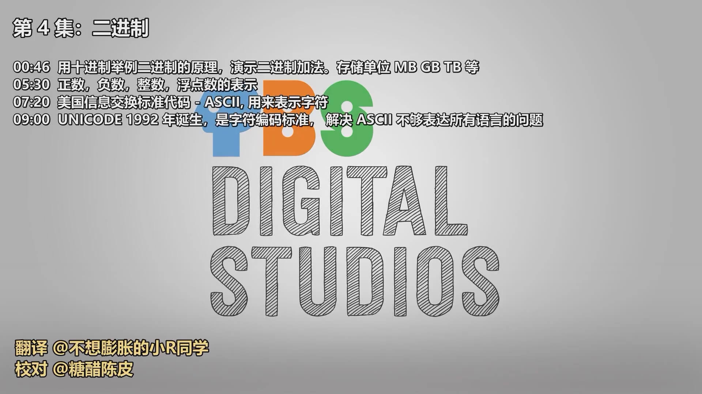
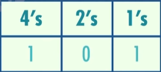
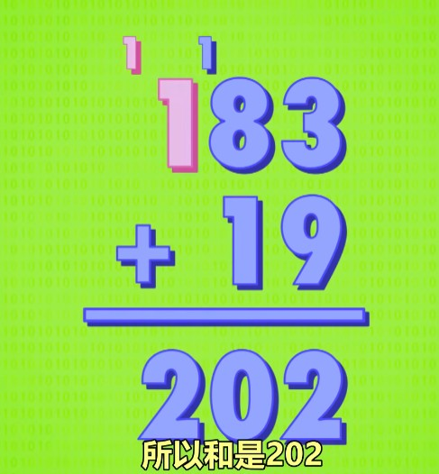
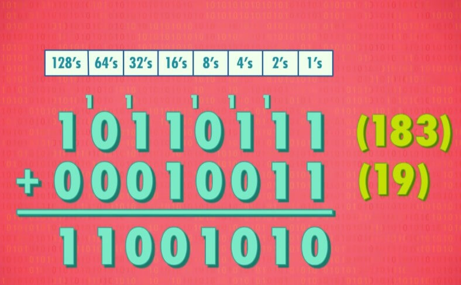

<Author
  author={{
    name: "虞嘉乐",
    imageURL: "/img/avatars/虞嘉乐.svg",
    title: "21 计算机 4 班",
  }}
/>

<BVideo src="BV1EW411u7th" p="4" />

## 二进制的计算

### 二进制的位数关系

二进制，是基于 2 的表示法，因为二进制中只有 0 和 1。因此，在二进制的计算中，相邻的两位中，左一位是右一位的两倍。比如在二进制中，101 就意味着有 1 个 4，0 个 2，1 个 1。

### 二进制转换十进制

当你知道了二进制每一位所代表的数字后，相加就可以得到十进制的数字。继续拿二进制的 101 作为例子，得出 4+0+1=5，故二进制中的 101 代表的是十进制中的 5

### 二进制之间的加减

二进制的加减与十进制没有太大的区别，二进制也是从最小的一位开始相加。区别在于，二进制是满二进一，十进制是满十进一，如下图

## 字节与位

### 位

在二进制中，一个 1 或 0，叫一"位"(bit)

### 字节

在计算机中，8 位是十分常见的内容，因此有了专门的名字：字节(byte)。

### 千字节与字节的换算

在十进制的算法中，1 千字节 = 1000 字节就如同 1 千克 = 1000 克一样。但是在二进制中，1 千字节并不是这么计算的。在二进制的算法中，1 千字节 = 2 的 10 次方 = 1024 字节，所以，不论是 1 千字节等于 1000 字节或者等于 1024 字节都是正确的。这也正是你在购买硬盘时商家显示的大小与实际上的大小并不相同的原因，商家是十进制，计算机是二进制。

### 常用的计算机位数

一般来讲，我们使用的计算机都是 32 位或 64 位，所以我们的计算机才能拥有如此丰富的色彩与能力。

## 二进制如何表现出各种类型的数据

### 二进制如何表达出数字的正负

大部分的计算机都是以第一位来代表数字的正负，1 代表负，0 代表正，而剩下的用来表示十进制数字

### 二进制如何表示浮点数

在计算机中，有多种方式表达浮点数，其中最常见的是 IEEE 754 标准。它用类似科学计数法的方法来存十进制值，例如，625.9 可以写成 0.6259\*10^3，其中，0.6259 是有效位数，3 是指数。在 32 位中，第一位代表数字的正负，接下来的 8 位代表着指数，而剩下的 23 位则是有效数字。

### 二进制表示文字

#### 1 最早使用编号表示的方法

与其使用特殊方式来表示字母，倒不如让计算机用数字来表示，而最简单的方法就是给字母标上编号。著名英国作家佛朗西斯·培根(Francis Bacon)曾用 5 位序列来编码英文的 26 个字母。5 位对于 26 个字母是绰绰有余，但无法表示标点符号、数字和大小写字母。

#### 2 ASCII 的诞生

由于佛朗西斯·培根的方法无法表示标点符号、数字和大小写字母，因此，ASCII(美国信息交换标准代码)在 1963 年诞生。ASCII 是 7 位代码，足以表达大小写字母、标点符号、数字、以及一些特殊的符号。由于 ASCII 是很早的标准，所以被广泛应用，让不同的公司制作的计算机能够互相交换数据，这种通用交换信息的能力叫 "互用性"。但 ASCII 本身是为了英文而存在的，所以其他国家很难使用。幸运的是，一个字节有 8 位，128 到 255 的字符留给了各个国家自己补充。

#### 3 统一所有编码的标准

尽管留有的字符对于大部分西方国家都足够使用，但如果在一个国家的电脑上打开用另一个语言写的电子邮件会造成乱码，而且中日等亚洲国家的语言有着数千个字符，无法用 8 位表示所有的字符。日本人更是因为编码的问题，以至于专门有词称呼：乱码(mojibake)。好在，于 1992 年，Unicode 诞生，统一了所有编码的标准。最常见的 Unicode 是 16 位，有超过一百万个位置，对于所有语言都足够了，甚至还能放点数学符号、emoji 等。

### 补充

除了以上谈到的这些之外，声音也好，色彩也好，画面也好，都是通过二进制表达的，而我们的计算机，网页、短信、视频甚至操作系统也都是一连串的 0 和 1。

## 接下来

让我们看看电脑如何操作二进制
