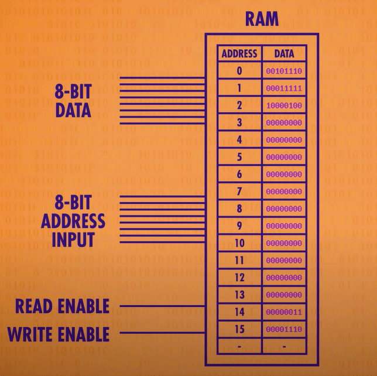

<BVideo src="BV1EW411u7th" p="6" />

## 计算机中的存储器

当我们在使用电脑时，突然断开计算机电源时，再次打开电脑，会发现，之前所有未保存的进度全部丢失了。

这是因为电脑使用的是 **随机存取存储器** 简称 **RAM** 。

它只会在通电的情况下才会存储东西，一旦断电，存储在 **RAM** 中的数据将会 **全部清除**!

另一种存储叫 **持久存储**（如硬盘，U盘，光盘等），即使断开电源，存储的数据也不易丢失

## 存储器的原理与制作

### 存 1 电路

目前为止，我们所说的电路都是单向的，比如 [8 位加法器](https://book.hyyz.izhai.net/cs/how-computers-calculate-the-alu/#8-%E4%BD%8D%E5%8A%A0%E6%B3%95%E5%99%A8)，但是，我们也可以把输出连回输入，如下图所示：

当 A 端输入 0 时，将会输出 0，B 端将会输入 A 端的值。

当A输入 1 时，将会输出 1，B 端这时也会输入 A 端的值。

但如果这时再次输入一个 0，结果将会是输出 1，B 端这时输入的值位 1。

但是问题是，即使尝试再多次，也无法将 1 变回 0！

这是一个 [或门](https://book.hyyz.izhai.net/cs/boolean-and-logic-gates/#or-gates%E6%88%96%E9%97%A8) 电路。

### 存 0 电路

如下图所示，当把 [或门](https://book.hyyz.izhai.net/cs/boolean-and-logic-gates/#or-gates%E6%88%96%E9%97%A8) 换成 [与门](https://book.hyyz.izhai.net/cs/boolean-and-logic-gates/#and-gates%E4%B8%8E%E9%97%A8) 时，当 A 端与 B 端相同时将会输出结果，如果当 A 端与 B 端都为 1 时，则会输出1，当 A 端与 B 端都为 0 时，将会输出 0，如下图所示：

这时如果将 A 端的值设置为 1，B 端的值设置为 0 时，将会是 0，如下图所示：

## 锁存器与门锁

### 锁存器

现在，我们有了存 0 锁存器和存 1 锁存器，我们可以把它利用起来，相结合成为「AND-OR 锁存器」

如下图所示：

上方的是 **SET** 输入，下方的是 **RESET**输入:

当 SET=1、RESET=0，就能将输出设置为 1。

当 SET=1、RESET=1，就能将输出设置为 0。

当 SET=0、RESET=0，则会输出 **最后放入的内容**。

这就是说它存住了一位的信息，这就叫「锁存」，因为它锁住了一个值。

放入数据的操作叫做「写入」，拿出数据的操作叫「读取」。

:::note

当 OR 门其中 **一个** 输入为 0 或 AND 门其中 **一个** 输入为 1，则相当于另外一个输入会直接被输出。

当 OR 门其中一个输入为 1，则 **直接输出 1**。

当 AND 门其中一个输入为 0，则 **直接输出 0**。

:::

### 门锁

用 **两条** SET 和 RESET **输入线来控制**，有点难理解，为了更容易用，我们希望 **只有一条输入线**。

因此 **将两条线** SET 和 RESET 变为 **允许写入线** 和 **数据写入线**，变为仅仅 **一条线控制，另一条线输入数据**，因此需要 **添加其他门控单元**，可以得到一个 **门锁**

通过门锁，将值锁起来。

门锁关闭，锁定原有值，当输入数据发生改变时，输出值不再发生变化。

门锁打开，输入值会写入到输出值。

如下图所示：

## 寄存器

虽然一个门锁只能存储一位数字，但是我们并排放 8 个锁存器，就可以存储8位信息，一组这样的锁存器叫「寄存器」，寄存器能够 **存一个数字**，这个数字的位数就称为寄存器的 **位宽**

写入寄存器之前，要先 **启动里面所有的锁存器**，可以将所有的锁存器的允许写入线 **都连接在一起，并把它设为1**，然后用 8 条数据线 **发送数据**，然后将允许写入线 **设为0**，就能将 8 位数据 **存储在寄存器中**

## 矩阵网络优化门锁放置

如果只有 **很少的位**，把锁存器并排放置，也 **勉强够用了**。

如果是 64 位寄存器，那么要 64 根数据线和 64 根连到输出端的线，以及 1 根启用寄存器的线，那么这样一个 64 位寄存器就需要 129 根线，256 位寄存器就需要 513 根线了，非常耗材。

可以通过 **矩阵形式排列来进行化简**。在矩阵中，不并列排放锁存器，而是做成表格，存 256 位，我们用 16*16 的网格锁存器，有 16 行 16 列，要 **启用某个锁存器**，就打开 **相应的行线和列线**

**打开交叉处，更多的细节如下：**

用一根行线和列线相并，只有他们都为1时才有效，AND 门才会输出 1，我们可以使用 **单个锁存器**。

这种排列法，用一根 **允许写入线(WRITE ENABLE)** 连所有锁存器。为了让锁存器变成「允许写入」，行线、列线和「允许写入线」都必须是 1。每次只有 1 个锁存器会这样，代表我们可以只用一根「数据线」连所有锁存器来传数据。其他锁存器会忽略数据线上的值，因为没有「允许写入」。

设置 WRITE ENABLE和READ ENABLE 才有用，否则这两条线的经过 AND 门的输出始终为 0。

当 WRITE ENABLE=1 时，输入数据就会 **保存在门锁中**。

当 READ ENABLE=1 时，就会连通晶体管，将 **存储在门锁中的数据输出**。

这里添加了一个 READ ENABLE 线来 **控制读取**，同时将 **输入输入和数据输出线合并**，从 3 条线减少为 2 条。

并且由于 **每次能够控制唯一一个锁存器**，所以所有的数据线可以合并成一条。也就是说，对于 256 位存储，只需要一条数据线，一条允许写入线，一条允许读取线和 16 行 16 列的线用来选择锁存器，一共 35 条线。

## 多路复用器

为了将 **地址** 转换成 **行和列**，需要用到 **多路复用器**，它能够连通输入对应的线，若输入「0001」那么多路复用器就会把第 1 路连通，达到选路的目的。

用 **一个多路复用器** 处理 **行**，**一个多路复用器** 处理 **列**，由此通过输入行和列的坐标就能定位到对应的锁存器了。

# 256 位寄存器
可以对 **256位寄存器** 进行封装，他输入的是一个 8 位的地址：

4 位表示行，4 位表示列。

同时需要允许写入线和允许读取线，

然后需要一根数据线用于读写数据。

再进一步拓展，可以将 8 个 256 位内存拼在一起，这样就**能够一次读写8bit数据**也就是**一个字节数据**

由于每个256位内存都使用相同的 8 位数据线，因此 8 位数据会存在每个 256 位内存的相同地址中，并且第一个 256 位内存存放第一位，第二个 256 位内存存放第二位，以此类推。

**这个模块可以在 256 个地址中存储 256 个字节。**

可以对其 **进行抽象**，看成一个整体的 **可寻址内存**，其中有256个地址，**每个地址** 能读写一个字节的值。

## 寻址地址

现代计算机可以在此基础上将内存扩展到 MB 和 GB 级别。

我们这里使用 **8 个 16x16 门锁矩阵** 可以得到 **256字节的内存**，然后可以用4位表示行 **4位表示列来进行寻址。**

随着内存地址增多，内存地址也必须增长。8位最多能代表256个内存地址
> 0000 0000 ~ 1111 1111（0~255）一共256个数字

要给千兆或者十亿字节的内存寻址，需要 32 位的地址

## 随机存储器

内存的一个 **重要特性** 是：能够 **随时访问任何位置**，所以称为 **随机存取寄存器（RAM）**

**RAM 只记录当前在干什么**

>RAM 中存储的数据会随着断电而消失！

这次，我们做了一个SRAM（静态随机存取存储器），还有其他比如DRAM、闪存等等，他们在功能上与SRAM相似，但用不同的电路存单个位，比如用不同的逻辑门、电容器、电荷捕获或忆阻器等等。但根本上，这些技术都是矩阵层次嵌套，来存储大量信息。

## 接下来

了解了寄存器和内存，那么我们就离计算机的核心 —— CPU 不远了。