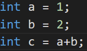

<Author
  author={{
    name: "虞嘉乐",
    imageURL: "/img/avatars/虞嘉乐.svg",
    title: "21 计算机 4 班",
  }}
/>

<BVideo src="BV1EW411u7th" p="11" />

## 机器的语言 —— 机器码

二进制是计算机的“母语”，也是计算机唯一能够理解的内容，这种用二进制编写的内容就是 **机器语言** 或 **机器码**。

## 让人头疼的伪代码

在计算机的早期阶段，必须用机器码写程序，所以人们会先在纸上写一个高层次版的。

比方说：算出今年的净利润等等。这种对程序的高层次描述就叫 **伪代码**。

在写完这些之后，会用 **操作码表** 把伪代码转成二进制机器码。翻译完成之后，程序就可以喂入计算机并运行了。

## 助记符与汇编器的互帮互助

可能你已经看出来了，这种编码方式十分的麻烦，人们很快就厌烦了。所以在 1940 年~1950 年代，程序员就开发出了一种更可读，更高层的语言。每个操作码分配一个简单的名字，叫 **助记符**，助记符后面紧跟数据，形成完整指令。

举个栗子，我们在第 8 章用到的 LOAD_A 14 就是一个助记符，从那以后，程序猿再也不怕查操作码了。当然，我们的 CPU 并不知道 LOAD_A 14 是什么意思，所以程序员想了个技巧，写二进制程序来帮忙，它可以读懂文字指令，自动转换成二进制指令，这个程序就叫做 —— 汇编器。

随着时间的推移，汇编器的功能越来越多，让编程更容易。比如：汇编器不用固定跳转地址，这样哪怕在程序开头多更新一些代码，汇编器也会自己搞定跳转地址。

## 高级编程语言的老祖宗 —— A-0

即使汇编器有很多厉害的功能，但它只是修饰了一下机器码，由于一条汇编指令对应一条机器指令，所以汇编码和底层硬件的关系十分紧密，这就导致了程序员依旧需要思考使用什么寄存器和内存地址，如果突然需要一个额外的数，可能要改很多代码。

为了解决这个问题，葛丽丝·霍普博士设计了最初的高级语言 —— “**算数语言版本 0**”，简称 “**A-0**”。

汇编码是与机器语言 一一 对应，但一行高级编程语言可能会转成几十条二进制指令。为了做到这种复杂转换，霍普博士在 1952 年创造了第一个编译器。编译器是一个专门把高级语言转成低级语言的工具。

尽管让编程变得简单这点十分的诱人，但很多人对霍普博士的点子持怀疑态度。她曾说：“我有能用的编译器，但没人愿意用，它们告诉我计算机只能做算术，不能运行程序”。霍普博士的点子无疑是极好的，不久，很多人尝试创造新的编程语言，如今有成百上千的语言。可惜的是，如今没有任何 A-0 的代码遗留下来。

### 论汇编代码为何更能让人掉头发

举一个简单的栗子，我们用任意两个数字相加，并保存结果，如果用汇编代码，我们得从从内存取值，和寄存器打交道，还由一大堆其他底层的细节。但如果你用高级编程语言就会非常的简单。在我用 C 语言的情况下，我可以不用管任何底层的细节，我只需要这样写就可以了 👇🏻

程序员只需要创建代表内存地址的抽象 —— 变量，顺带着给变量取个名字就可以了。要注意的是，变量可以取任何名字，但依旧有一些命名规则要注意，否则你的变量就是不可用的。[变量的小贴士](https://www.runoob.com/cprogramming/c-variables.html)

## “懒人”创造的语言 —— FORTRAN

**FORTRAN**这门语言在 1957 年由 IBM 发布，主宰了早期的计算机编程。FORTRAN 项目总监 John Backus 说过“我做的大部分工作都是因为懒，我不喜欢写程序，所以我写这门语言，让编程更容易”。

:::note

啧，听得我想与他进行一场肉体之间的碰撞 —— 我的拳头与他的脸。

:::

平均来说，FORTRAN 写的程序比等同的手写汇编代码短 20 倍（难怪主宰了早期的计算机编程，确实香），让程序员编写速度大大加快。

## 数据系统语言委员会与第一门通用的高级语言“COBOL”

由于早期的大多数编程语言只能在一种计算机上，如果要升级电脑，可能得把代码重新写一遍。因此计算机专家们在 1959 年组建了一个联盟 —— “**数据系统语言委员会**”，而我们的霍普博士担任了顾问，开发一种通用编程语言，可以在不同机器上使用。最后诞生了一门高级的，易于使用的，面向大众的语言，“**普通面向商业语言**”，简称“**COBOL**”。

为了兼容不同底层硬件，每个计算架构需要一个 COBOL 编译器，而这些编译器都可以接收相同的 COBOL 代码，不管是什么电脑。这就叫做“一次编写，到处运行”，如今大部分的编程语言都是这样的。这让编程大大降低了门槛，让更多的人能用到编程。

## 接下来

计算机的历史才不会只停留在 1959 年咧，编程语言和硬件一起飞速发展，事到如今有了成百上千的编程语言，更有不少鏖战至今的语言，像 70 年代的 C 语言，80 年代的 C++，90 年代的 Python，Java 等等。

那么下一章我们走进编程原理，先去了解下语句和函数
