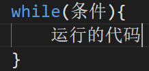
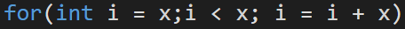

<Author
  author={{
    name: "虞嘉乐",
    imageURL: "/img/avatars/虞嘉乐.svg",
    title: "21 计算机 4 班",
  }}
/>

<BVideo src="BV1EW411u7th" p="12" />

:::note

前排提醒：本章中用到的所有语句都是 C 语言的写法，语法会因为编程语言的不同而改变，但意思都是差不多的，只是编写代码时的写法有所改变

:::

## 我，编程语言，也有专属于自己的语法

规定编程语言的句子结构的一系列规则叫语法，所有的编程语言都有语法。

### 最简单的语句是我赋值语句哒

让我们来举一个简单的栗子：a = 5 。这句话的意思是，创建一个变量 a，并且把 5 赋值给 a。这种语句就叫做赋值语句，把一个值赋给一个变量。关于变量命名的规则，在上一章中有给链接。 [才不是变量命名规则的链接呢](https://www.runoob.com/cprogramming/c-variables.html)

#### 稍稍进阶一点点的赋值语句

赋值语句可以用自身相加，或者是赋值语句之间相加。比如：

要注意的是，这里用的例子是 C 语言，不同的语言之间的赋值语句会稍有不同，比方说，在 Python 中，直接写 a = 1 就可以了，并不需要写出变量类型（int 就是变量类型，意思是整型），也不用写分号。

## 变量：我有初始值啦

初始化变量其实很简单，就是变量最初的一个赋值，在上面提到的例子中，a = 1 是初始化变量，a = a+1 不是初始化变量。

## 是对呢，还是不对呢？

控制流语句，也可以叫做判断语句，如同它的名字一般，它会对你提出的条件进行判断是真是假，可以理解成 如果 a 是真就运行 b，如果 a 是假，就运行 c。判断语句有好几种，最常见的是 if 语句。如下图

_小贴士：if 是如果的意思，else 是否则的意思，其他的不用理会，在学到对应语言的时候会知道它们的作用的_

## 欸，我怎么又回到这里了？

循环语句，也和它的名字一样，效果是起到循环的作用。常用的循环语句有 while、for 等。while 的循环条件为真时，代码会重复运行至条件为假。for 循环则是根据次数来运行。这是 while

这是 for，x 是根据需求进行更改的内容，括号内则是控制循环的次数，这个 x 可以填任意的数，只要不超过计算机的最大范围就可以了。

## 好用的工具人

有的时候，我们需要经常使用某串相同的代码，它们几乎没有太大的区别，只有少部分的变量名或数据改变，因此需要大量的复制粘贴。但如果有某个部分在更改的时候出了错，就意味着你需要一个个检查。

那么问题来了，有没有什么可以让你重复使用而且十分好改的东西呢？没错，当然有，那就是——外部函数！

外部函数，是将一串代码打包起来，能够多次的使用的东西。外部函数的命名并无太多需求，但请尽量与你在这串代码中想要表达的意思有关，避免未来忘记。（不写注释，不带特殊含义，一个月内只有我和上帝知道这串代码的意义，一个月后，就只有上帝知道了）而且外部函数要远远比复制粘贴后的那一堆代码好修，毕竟只用看一串代码，而不用看大量的重复代码。

### 返回值，是外部函数最好的伙伴！

返回值，也就是**return**，你需要在使用外部函数的那部分代码中，在外部函数名旁的括号内写下需要的数据，return 会把在外部函数中运行的结果交给使用这个函数的代码。在下图中，最终的结果是 10。

## 人多力量大

很多的程序都需要非常多的代码，为了简洁，也为了更容易被看懂，所以现代的软件都是由上千个函数组成，每个负责不同的事。这样模块化的编程，不经可以让单个程序员独立制作 APP，也可以让一群人同时做同一个的程序，不同的程序员写不同的函数，最后组合在一起，就可以了（当然了，你得先能正常运行）

## 俯首甘为孺子牛

在现代编程语言中，有很多预先写好的函数集合，叫做库。库由专业人员编写，不仅效率高，而且经过了仔细检查，几乎做所有事情都会有库。

## 接下来

下一章，我们会学到算法。

小剧场！

博士博士，算法是什么啊，是一种新的蜜饼吗？

不是哦，小刻。算法非常简单，是小刻都能学会的东西哦。如果小刻学不会，那就是证明小刻没有认真学，小刻要把自己的蜜饼给博士以做惩罚。但如果学会了，博士可以奖励小刻一份大餐！

嗯嗯，为了蜜饼，小刻一定认真学！

（后来，博士因欺诈小刻的食物而成为老女人的握力计）
