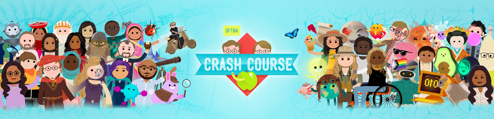
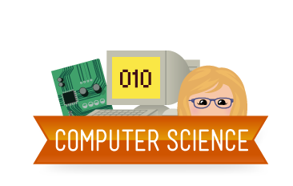

CrashCourse 是网上非常著名的在线速成课程，课程覆盖文化、历史、哲学、物理、化学、生物、天文、商业、经济、计算机、艺术、游戏、建筑、神秘学等。

计算机科学是一门系统性研究信息和计算的理论基础以及它们在计算机系统中如何实现与应用的实用技术的学科。虽然叫做计算机科学，但是其相当一部分领域都不涉及计算机本身的研究，更多的与数学、工程学、认知科学和经济学有交叉。

CrashCourse 的这一套**计算机科学速成课**帮助我们快速学习计算机科学，每个视频十几分钟，一共四十课时。跟着主讲人 Carrie Anne 学完整个课程，会让我们对计算机科学有大致了解。

我会把原视频和自己的笔记一起放在网站上方便大家阅读，同学们可以跟我一样边看视频边记笔记，由于原视频是英文的，也感谢网友们自发翻译成中文，他们是知识的传播者。

好了，我们一起进入第一课时的学习：了解计算机的早期历史。
