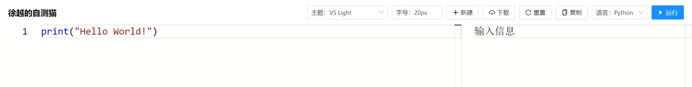

## 在线

### 本网站

本站可提供交互式编程学习，可以进行简单的代码编写、运行。

### 我做的自测猫网站

平时我的课程中，大家可以使用 [自测猫](https://code.hyyz.izhai.net)，选择 Python 语言进行在线编写。

## 本地

在没有网的情况下，你想写 Python 语言代码，需要先安装 **解释器**，然后再安装 **代码编辑器**。

### Python 解释器

Python 是解释型语言，需要一个 **解释器** 支持其运行。

#### 1. 下载并安装

[Python 解释器下载地址](https://www.python.org/downloads/)

#### 2. 测试

#### 视频

### Visual Studio Code

[VSCode 代码编辑器](https://code.visualstudio.com)，免费的。

<BVideo src="BV1bK411P767" />

### PyCharm

[PyCharm 集成开发环境](https://www.jetbrains.com/zh-cn/pycharm/download/)，**社区版** 是免费的。

<BVideo src="BV12h41147Xn" />
